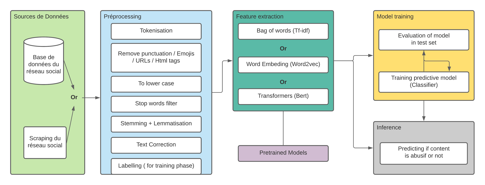

# Text-Mining-Amazon-Reviews

# Data Analysis and Text Mining

```
The goal of this project is to process a text dataset using data mining and machine learning
methods and to extract knowledge from it. Prepare a report for this Project.
In this Project you will use Amazon Reviews dataset
```
The project contains the following 4 parts:
```
1. Text processing and Transformation
2. Analysis of the dataset
3. Machine learning and prediction
4. Visualization of the prediction results
5. Theoretical formalism
1. Text Processing and Transformation

```
## 1. Text processing and Transformation
### A. Extracting features from text files
In order to perform machine learning on text documents, we first need to turn the text
content into numerical feature vectors using:

- Bags of words:
The most intuitive way to transform the text into a vector is to use a bags of words
representation:
    1. Assign a fixed integer id to each word occurring in any document of the
training set (for instance by building a dictionary from words to integer indices).
    2. For each document #i, count the number of occurrences of each
word w and store it in X[i, j] as the value of feature #j where j is the index of
word w in the dictionary.
- Tokenizing text with scikit-learn
Text preprocessing, tokenizing and filtering of stopwords are all included
in CountVectorizer, which builds a dictionary of features and transforms
documents to feature vectors.

### B. From occurrences to frequencies
Occurrence count is a good start but there is an issue: longer documents will have
higher average count values than shorter documents, even though they might talk
about the same topics.
To avoid these potential discrepancies it suffices to divide the number of
occurrences of each word in a document by the total number of words in the
document: these new features are called TF for Term Frequencies.
Another refinement on top of TF is to downscale weights for words that occur in
many documents in the corpus and are therefore less informative than those that
occur only in a smaller portion of the corpus.
This downscaling is called TF_IDF for “Term Frequency times Inverse
Document Frequency”.
Both TF and TF-IDF can be computed as follows using TfidfTransformer
Note : You can use another type of transformation, i.e. word2vec, document2vec,...

## 2. Analysis of the dataset
In order to analyze the dataset, you have to extract some statistical information from the
given dataset, for example: the type of data, the missing values, outliers, the correlation
between variables, etc. This part should contain also the analysis of the domain application
and explain the goal of the analysis and prediction.

## 3. Machine Learning
### 1. Use the Regression Line 
to predict values for some variables (you can choose any variableas a target. Compute the error.

### 2. Use a machine learning method (clustering and/or classification)
in order to predict the class of a new set of objects. You can use the methods as K-Nearest Neighbours (K-NN),
Support Vector Machine (SVM), Decision trees, Neural Networks ... The obtained results
should be validated using some external indexes as Prediction Error or others. The obtained
results should be analyzed in the report and provide a solution to ameliorate the results.
## 4. Visualization:
You can visualize the knowledge extracted from the classification/clustering in order to
present the results i.e. scatter plots using predicted colors, decision trees,...
## 5. Theoretical details:
Give the algorithmically (mathematical) formalism of the method which give the best
results. Explain all the parameters of the used method and their impact on the results.

Some comparison should me made to conclude the project.


